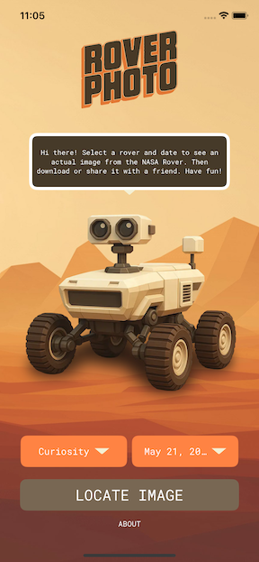

# 📱 Rover Photo
> Select a Mars rover, a date, and see a picture of what Mars looked like on that day!

---

## 🧠 About

Rover Photo is an iOS app built with UIKit then rewritten in swiftUI that leverages a NASA API to display photos of any three rovers: Spirit, Opportunity, and Curiosity.  The user gets to select a date and an image taken from the selected rover on the given date.

It was originally created as learning project and demonstrates key iOS development skills including networking, decoding data, and autolayout

--MAY 21 UPDATE--
rewritten in swiftUI

--Rover States--
Curiosity:
Landed: August 6, 2012
Status: Active

Spirit
Landed: January 4, 2004
Status: Mission ended March 2010 (stuck in sand, lost contact)

Opportunity
Landed: January 25, 2004
Status: Mission ended June 2018 (dust storm, declared dead in Feb 2019)

---

## 🖼️ Screenshots

 


---

## ⚙️ Tech Stack

- Swift
- UIKit (refactored out for swiftUI)
- swiftUI
- URLSession / JSON Decoding (refactored out for swiftUI)
- combine
- Auto Layout (refactored out for swiftUI)
- NASA API: https://api.nasa.gov/

---

## 🚀 Getting Started

To run this project locally:

```bash
git clone https://github.com/your-username/your-repo.git
