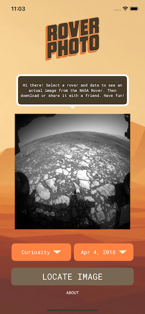

# 📱 Rover Photo
> Select a Mars rover, a date, and see a picture of what Mars looked like on that day!

---

## 🧠 About

Rover Photo is an iOS app built with UIKit that leverages a NASA API to display photos of any three rovers: Spirit, Opportunity, and Curiosity.  The user gets to select a date and an image taken from the selected rover on the given date.

It was originally created as learning project and demonstrates key iOS development skills including networking, decoding data, and autolayout.

---

## 🖼️ Screenshots

 


---

## ⚙️ Tech Stack

- Swift
- UIKit
- URLSession / JSON Decoding
- Auto Layout
- NASA API: https://api.nasa.gov/

---

## 🚀 Getting Started

To run this project locally:

```bash
git clone https://github.com/your-username/your-repo.git
